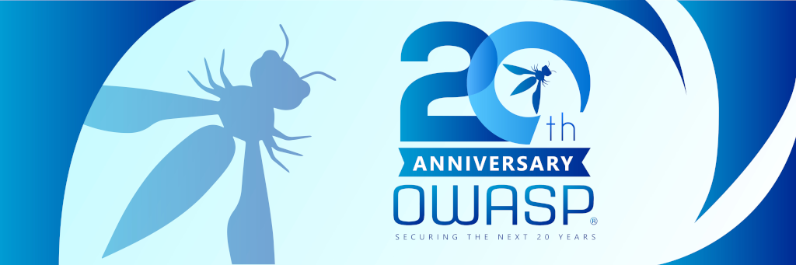
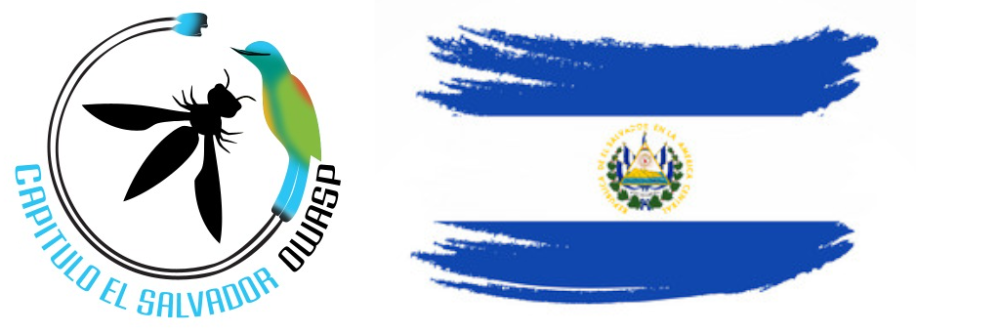

---

layout: col-sidebar
title: OWASP El Salvador
tags: OwaspSV
level: 0
region: Central America
country: El Salvador
postal-code:
meetup-group: owasp-el-salvador-meetup-group

---

### Bienvenid@s al capítulo OWASP de El Salvador

El capítulo OWASP El Salvador tiene como objetivo compartir conocimientos con todas las personas interesadas en la cultura de la seguridad informática, así también compartir conocimientos de cómo encontrar vulnerabilidades en aplicaciones Web, móviles y también cómo prevenirlas, basándose en los documentos y guías Top 10 de OWASP, además de otros recursos disponibles en la Red.

### Reuniones

Estaremos agendando nuestras charlas virtuales o futuras reuniones presenciales en [Meetup OWASP El Salvador](https://www.meetup.com/owasp-el-salvador-meetup-group/). Debido a la situación de Covid-19, las charlas presenciales estarán en pausa y en el futuro serán tratadas acorde a las disposiciones de bioseguridad que estipule el Gobierno local.

Nuestros eventos (charlas o talleres), están dispuestas para todo público y no necesitas ser miembro de OWASP para asistir. Sin embargo, si consideras valiosos los aportes por parte de nuestra comunidad a través de charlas, talleres o proyectos de OWASP, puedes considerar [unirte como miembro](https://owasp.org/membership/) o patrocinar este Capítulo (puedes ponerte en contacto con los líderes para más detalles de patrocinio).

### Participación

El Proyecto Abierto de Seguridad de Aplicaciones Web (OWASP) es una fundación sin fines de lucro que trabaja para mejorar la seguridad del software. Todos los proyectos, herramientas, documentos, foros, y capítulos son libres para cualquier persona interesada en mejorar la seguridad de las aplicaciones. 

Los capítulos son dirigidos por líderes locales de acuerdo al [Manuel de líders de Capítulo](/www-policy/rules-of-procedure/chapter-handbook). Las contribuciones financieras solo se harán a través del uso del botón autorizado para donaciones en línea. Para ser un expositor en cualquier capítulo OWASP del mundo, revisa el [Acuerdo para Expositores](/www-policy/speaker-agreement) y luego ponte en contacto con algún líder del capítulo local con los detalles del proyecto OWASP, investigación independiente o algún tema relacionado a la seguridad del software que quieras presentar.

Cualquier persona es bienvenid@ y está encarecidamente animado a participar en nuestros [Proyectos](/projects), [Capítulos locales](/chapters), [Eventos](/events), [Grupos en línea](https://groups.google.com/a/owasp.com/), y nuestro [Canal comunitario en Slackl](https://owasp.slack.com/). Animamos la participación de la diversidad en todas nuestras iniciativas. OWASP es un lugar fantástico para aprender sobre seguridad en aplicaciones, netowrking e incluso construir tu reputación como un experto. Te animamos a que te conviertas en [miembro](/membership) o consideres hacer una [donación](/donate) para apoyar nuestro trabajo continuo.

